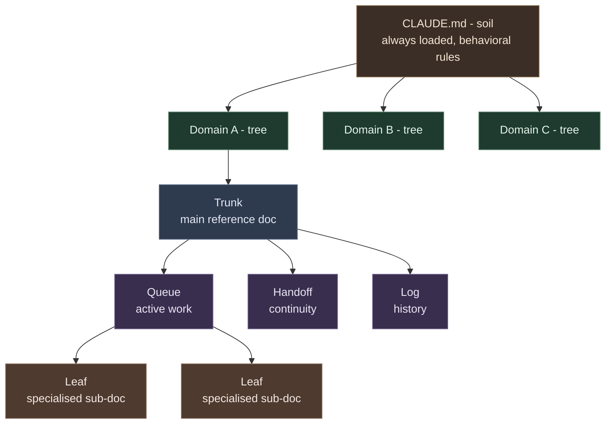

# Atlas Method


**A lean-by-design documentation methodology for running your life through Claude Code.**

Atlas Method is the structure underneath a personal operating system built on Claude Code: a forest of small, self-contained domain docs, governed by one set of behavioural rules, kept deliberately lean so that context - the scarcest resource in any AI session - is never wasted.

It is not an app. It is not a framework you install and run. It is a way of shaping your files so that an AI assistant can pick up any corner of your life cold, work on it without drowning in irrelevant context, and hand off cleanly to the next session.

## Contents

- [What Atlas Method Is](#what-atlas-method-is)
- [Quick Install](#quick-install)
- [Full Setup](#full-setup)
- [The `/atlas` Command](#the-atlas-command)
- [The Philosophy](#the-philosophy)
- [The Forest Model](#the-forest-model)
- [Contributing](#contributing)

---

## What Atlas Method Is

Most people who try to run their life through an AI assistant hit the same wall: the context window. Pour everything into one giant file and the assistant reads slower, reasons worse, and eventually cannot hold it all. Split everything into a thousand files and the assistant cannot find anything.

Atlas Method resolves this with three load-bearing ideas:

- **Small trees.** Each domain - a project, a hobby, your finances, a health log - is its own small tree of documents. Independent. Self-contained. Deliberately kept small, because context is finite and large documents lose information.
- **Context discipline.** A session reads only the files for the domain it is working on. Never "just in case." The rules that enforce this live in one always-loaded file, the soil, that every session inherits.
- **Scout-first.** Wide or heavy work is delegated to spawned agents - cheap scouts for retrieval, builders for execution - so the main conversation stays lean and fast.

The result is a system that scales with your life instead of collapsing under it.

---

## Quick Install

```sh
git clone https://github.com/DamianBuilds-ai/atlas-method.git
cd atlas-method
sh versions/v1.0.0/bin/atlas-init ~/my-system
```

This scaffolds a fresh instance in `~/my-system`: a CLAUDE.md from the template, the four-document skeleton for your first domain, and the supporting structure. Open the new directory in Claude Code and start filling in the placeholders.

---

## Full Setup

1. **Clone the repo** and pick a home for your system - a directory Claude Code will open as a project.
2. **Run `atlas-init`** pointing at that directory. It copies the skeleton templates into place and creates your CLAUDE.md from the template.
3. **Fill in CLAUDE.md.** This is the soil. Replace the placeholders with your name and your first two or three domains. Do not pre-create domains you do not yet need.
4. **Create your first domain** by copying the four skeleton docs (`DOMAIN.md`, `DOMAIN_QUEUE.md`, `DOMAIN_HANDOFF.md`, `DOMAIN_IDEAS.md`) and renaming them. See `versions/v1.0.0/examples/` for a worked example.
5. **Wire the `/atlas` command** by copying `versions/v1.0.0/commands/atlas.md` into your Claude Code commands directory.
6. **Optional: install the hooks** so spawned agents automatically inherit the universal rules and safety prohibitions. See `versions/v1.0.0/hooks/`.

Every file you copy in is yours to edit. The templates teach the structure; the content is your life.

---

## The `/atlas` Command

`/atlas` is the self-audit. Run it and the methodology inspects your own system against its own rules: are any trunks too long, are leaves outgrowing their cap, are queues stale, is a domain leaking context into its neighbours. It surfaces drift as neutral prompts - "three items have not moved in a while, want to review?" - and never grades or auto-fixes. You decide.

It is the methodology turned back on itself. The same discipline you apply to your domains, applied to the system that holds them.

---

## The Philosophy

Three principles do most of the work.

**Small trees.** Context is finite. A 2,000-line document is a liability - the assistant reads it slowly and reasons over it poorly. A 200-line document is an asset. So every tree is kept small on purpose. Leaves cap at ~300 lines; trunks at ~500. When something outgrows its cap, it splits. Growth is sideways, into more small trees, never upward into one big one.

**Context discipline.** The most expensive mistake an AI session can make is reading a file it did not need. Every irrelevant token spent is a relevant token it cannot spend later. So domain isolation is the law: read only what this domain needs, ask before crossing domains, and never explore to "understand the system" - the map already exists.

**Scout-first.** The main conversation is the scarcest real estate in the system. Protect it. Delegate retrieval to cheap scout agents, mechanical work to builders, design to architects - and keep the main session for what only it can do: talk to you, synthesise, and decide.

---

## The Forest Model

The whole system is a forest of small trees. One vocabulary describes every part of it:



- **Soil** - `CLAUDE.md`. Always loaded. The behavioural rules that nourish every tree. Rules, not content.
- **Tree** - a domain. Independent and self-contained, rooted in the soil.
- **Trunk** - a domain's main reference doc (`DOMAIN.md`). The stable facts.
- **Branches** - a domain's supporting docs (`DOMAIN_QUEUE.md`, `DOMAIN_HANDOFF.md`). What is active, what just happened.
- **Leaves** - specialised sub-docs (`DOMAIN-TOPIC.md`). Loaded only when needed.

A new domain is a new tree. A new sub-topic is a new leaf. The soil never changes shape; the forest grows around it.

---

## Contributing

Atlas Method is MIT licensed and open to improvement. The methodology evolves through real use - if a rule earns its place by preventing a real failure, it belongs; if it is decoration, it does not.

Open an issue to propose a change to the methodology, or a pull request against the skeleton, the docs, or the `/atlas` command. Keep the lean-by-design spirit: every addition should pay for the context it costs.

> **Note:** Atlas Method is the methodology, published on its own. It is intentionally separate from any individual's personal operating system or portfolio. This repo contains clean, generic templates - no personal data, no private domains. Fill it with your own.

---

*MIT licensed. Built for Claude Code.*
