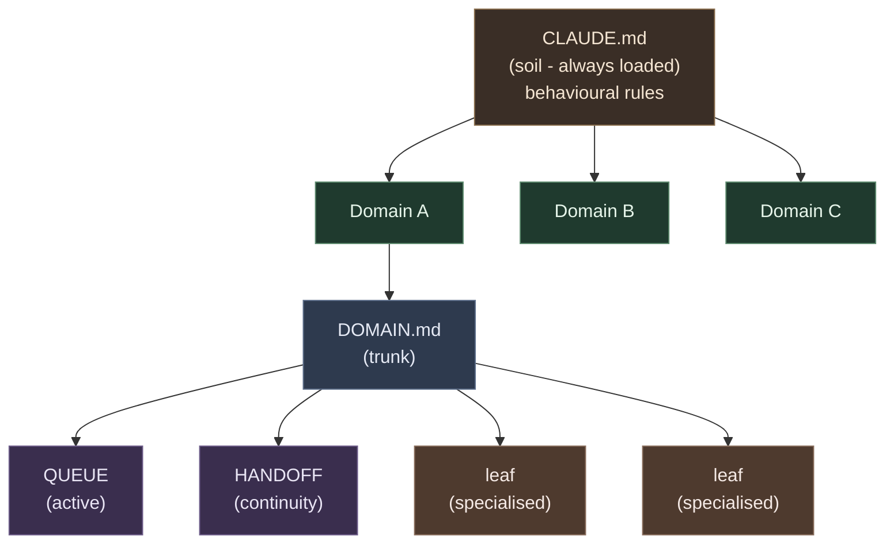
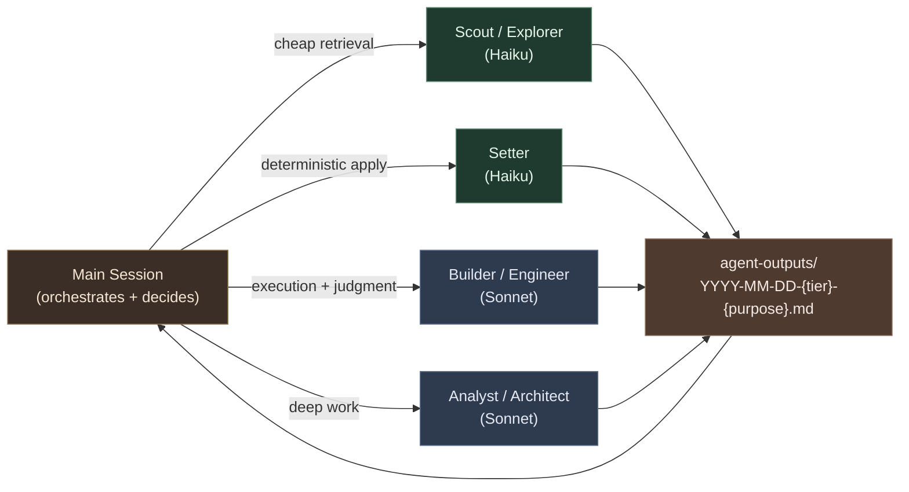
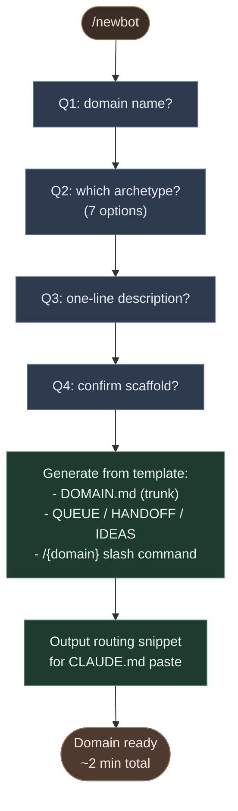

# Atlas Method

*Lean-by-design methodology for running your life through Claude Code.*


A forest of small, self-contained domain docs governed by one set of behavioural rules, kept lean so context - the scarcest resource in any AI session - is never wasted.

Clone, run one script, and you have a working personal operating system on Claude Code in under 20 minutes.



---

## Install

```sh
git clone https://github.com/DamianBuilds-ai/atlas-method.git
cd atlas-method
sh versions/v1.1.0/bin/atlas-init ~/my-atlas
```

Open `~/my-atlas` in Claude Code. Full walkthrough: [QUICKSTART.md](versions/v1.1.0/QUICKSTART.md).

---

## What is Atlas Method?

Most people who try to run their life through an AI assistant hit the same wall: the context window. Pour everything into one giant file and the assistant reads slower, reasons worse, and eventually cannot hold it all. Split everything into a thousand files and it cannot find anything. Atlas Method resolves this with a forest of small trees.

**Soil.** `CLAUDE.md` is the soil. Always loaded. Holds the behavioural rules - domain isolation, scout-first dispatch, wrap protocol, agent delegation - that every session inherits. Rules, not content. The soil never changes shape.

**Trunk.** Each domain has one trunk doc (`DOMAIN.md`). The stable facts. The map of the territory. Kept under 500 lines so a session can read it whole without burning context.

**Branches.** `DOMAIN_QUEUE.md` (what's active), `DOMAIN_HANDOFF.md` (continuity to the next session), `DOMAIN_LOG.md` (history). These are the load-bearing branches of every tree.

**Leaves.** Specialised sub-docs (`DOMAIN-TOPIC.md`). Loaded only when needed. Capped at ~300 lines. When a leaf outgrows its cap, it splits. Growth is sideways, never upward.

A new domain is a new tree. A new sub-topic is a new leaf. The forest grows around the soil.

---

## Agents do the work

Main session orchestrates. Tiered agents do the work. Output flows back through `agent-outputs/` so context stays lean.

| Tier | Model | Role |
|------|-------|------|
| Explorer | Haiku | Wide discovery in unknown territory |
| Scout | Haiku | Targeted retrieval, quick lookups |
| Setter | Haiku | Deterministic apply (insert row, set value) |
| Analyst | Sonnet | Research, pattern finding, comparison |
| Builder | Sonnet | Mechanical execution with verification |
| Scribe | Sonnet | Documentation, transcription |
| Engineer | Sonnet | Execution with local judgment calls |
| Researcher | Sonnet | Deep multi-source investigation |
| Architect | Sonnet | Design, ADR-level decisions |



---

## Scaffold a domain

`/newbot` asks 4 questions and scaffolds a new domain in 2 minutes.



**Seven archetypes** ship with v1.1.0:

- `single-purpose` - one scope, no persona (Hermes / Drake shape)
- `companion` - persona-led, verbatim protocol, status + handoff + personality
- `learning-system` - topic + coursework + progress (Feynman shape)
- `business` - product or commercial domains
- `bot-product` - Telegram bots with Meridian framework hooks
- `game` - game-state tracking (Warframe / EVE / OSRS shape)
- `job-search` - opportunity dossiers + applications

Pick the shape that fits, answer four questions, get a working domain with the right four-document skeleton and a wired slash command.

---

## What's new in v1.1.0

- **`/newbot`** - interactive scaffolder, 7 archetypes, 2 minutes per new domain
- **Wrap protocol** - 8 steps with `wrap` / `checkpoint` / `sync` cookies
- **4 hooks** - em-dash guard, scratchpad nudge, wrap-push reminder, task-output verify
- **Audit-only `/atlas`** - methodology turned back on itself (no auto-fixes, only neutral prompts)
- **Tier-named agents** - Explorer / Scout / Setter / Analyst / Builder / Scribe / Engineer / Researcher / Architect

Full migration guide: [MIGRATION_v1.0.0_TO_v1.1.0.md](versions/v1.1.0/MIGRATION_v1.0.0_TO_v1.1.0.md).
Detailed changes: [CHANGELOG.md](versions/v1.1.0/CHANGELOG.md).

---

## Repo layout

```
atlas-method/
├── README.md              ← you are here
├── LICENSE                ← MIT
└── versions/
    ├── v1.0.0/            ← first public release
    └── v1.1.0/            ← current
        ├── QUICKSTART.md  ← 20-minute walkthrough
        ├── MIGRATION_v1.0.0_TO_v1.1.0.md
        ├── CHANGELOG.md
        ├── bin/           ← atlas-init bootstrap script
        ├── commands/      ← /atlas, /newbot
        ├── docs/          ← methodology specification
        ├── hooks/         ← 4 hook scripts + README
        ├── procedures/    ← wrap.md and others
        ├── skeleton/      ← four-document templates
        ├── templates/     ← 7 archetype templates for /newbot
        └── examples/      ← one worked domain
```

---

## Philosophy

**Small trees.** Context is finite. A 2,000-line document is a liability; the assistant reads it slowly and reasons over it poorly. A 200-line document is an asset. Every tree is kept small on purpose. Leaves cap at ~300 lines, trunks at ~500. When something outgrows its cap, it splits. Growth is sideways, into more small trees, never upward into one big one.

**Context discipline.** The most expensive mistake an AI session can make is reading a file it did not need. Every irrelevant token spent is a relevant token it cannot spend later. Domain isolation is the law: read only what this domain needs, ask before crossing domains, and never explore to "understand the system" - the map already exists.

**Scout-first.** The main conversation is the scarcest real estate in the system. Protect it. Delegate retrieval to cheap scout agents, mechanical work to builders, design to architects. Keep the main session for what only it can do: talk to you, synthesise, and decide.

---

## Contributing + feedback

Atlas Method evolves through real use. If a rule earns its place by preventing a real failure, it belongs. If it is decoration, it does not.

Open an issue to propose a methodology change, or a pull request against the skeleton, the docs, the templates, or the slash commands. Keep the lean-by-design spirit - every addition should pay for the context it costs.

---

## License + version

MIT licensed. Public version v1.1.0 maps to internal methodology v7.5.x. Maintainer: [DamianBuilds-ai](https://github.com/DamianBuilds-ai).

> **Note:** Atlas Method is the methodology, published on its own. It is intentionally separate from any individual's personal operating system or portfolio. This repo contains clean, generic templates - no personal data, no private domains. Fill it with your own.

*Built for Claude Code.*
